# Fuzuli v0.1 — Building a Latinized Ottoman Turkish Language Model from Scratch

**Fatih Burak Karagöz** — May 2026

---

## Abstract

**Fuzuli v0.1** is an 84-million-parameter decoder-only language model trained from scratch on Latinized post-1500 Ottoman Turkish. The training corpus consists of 24,253 OCR-cleaned pages (70.1 million characters, ≈8 million unique tokens under a custom 24,000-token BPE vocabulary) drawn from 59 distinct historical documents — among them the full available *Seyahatnâme* of Evliya Çelebi, the complete 25-volume run of the late-Ottoman periodicals *Sebilürreşad* and *Sırat-ı Müstakim*, and 25 individual classical and late-classical works ranging from Necati Bey's *Dîvân* (1500) to *Üç Devirde Gördüklerim* (1866). No foreign weights were inherited; no model was fine-tuned. The tokenizer, the training data, and the model weights are all produced end-to-end inside the project.

This first version is released as a research artifact, not a production tool. It demonstrates that a small from-scratch Ottoman language model is feasible at the current data scale, and it documents an autoresearch methodology — a deterministic factory paired with an LLM-based research agent under strict eval-policy control — that produced 6 baseline-improving recipes out of 356 candidate experiments in the model's first 24 hours of life.

---

## 1 — Why Ottoman Turkish, why from scratch

Ottoman Turkish is not a single language, it is six centuries of overlapping registers — classical *dîvân* poetry, *seyahatnâme* travel prose, *tezkire* biographical compilations, late-Ottoman periodical journalism, *risâle* religious treatises — written across a script transition (Arabic-letter to Latin-letter, formalized in 1928) that broke continuity for most modern computational tools. The corpus that does exist in machine-readable Latinized form is small, scattered across academic websites, and rarely curated for language modeling.

Fine-tuning a multilingual model is the easy path; it is also the path that bakes in modern Turkish bias and imports tokenization choices made for languages that share almost no morphology with Ottoman. The decision here is the harder one: own the tokenizer, own the data pipeline, own every weight from the first matmul forward. The cost is a smaller model trained on less data; the benefit is an artifact that is unambiguously *of* the corpus it was trained on. This stance follows a wider tradition of from-scratch low-resource language models — BERTurk [12], the OSCAR-trained European national models [16], and curated-corpus small-LM training in the spirit of TinyStories [13] — which have repeatedly demonstrated that a smaller, language-faithful model trained on a curated in-domain corpus outperforms a larger multilingual model fine-tuned on the same downstream task.

### 1.1 — A note on prior work

Fuzuli continues a line of work I have contributed to on the computational treatment of Ottoman Turkish. In *Towards a Clean Text Corpus for Ottoman Turkish* (Karagöz, Doğan & Özateş, SIGTURK 2024) [18], my co-authors and I constructed an initial cleaned Ottoman corpus and used it for **continual pre-training** of BERTurk [12], demonstrating that even modest amounts of in-domain text can adapt a Modern Turkish encoder to a historical variant for downstream tasks such as named entity recognition. The cleaning methodology developed there — regex-based normalization, handling of intertwined bidirectional Arabic/Latin script, private-use-area character mapping, dehyphenation — is the direct predecessor of §2's four-stage pipeline.

The broader infrastructure effort I co-author with the Boğaziçi NLP group, *Building Foundations for Natural Language Processing of Historical Turkish: Resources and Models* (Özateş et al., 2025) [19], introduced the **HisTR** dataset, the **OTA-BOUN** Universal Dependencies treebank, and the **OTC** corpus, alongside fine-tuned task models published under the `bucolin` organization on HuggingFace. That work establishes concrete downstream baselines for historical Turkish — NER F1 of **90.29** on HisTR, dependency-parsing LAS of **73.79** on OTA-BOUN, POS F1 of **94.98** — against which a from-scratch decoder-only successor can be measured.

Fuzuli takes the next step in that programme. Rather than continually pre-training or fine-tuning Modern Turkish base models, it trains a decoder-only language model end-to-end on the historical variant alone — with its own tokenizer, its own frozen evaluation harness, and no inherited weights. The progression is intentional: encoder fine-tuning answers *can the existing infrastructure be adapted?*, and the answer is *yes, partially*. From-scratch decoder pretraining answers a different question — *what does the language look like to a model that has never been told anything about Modern Turkish?* — and the resulting artifact is, by construction, free of any Modern-Turkish prior.

## 2 — The corpus

The training data is the union of two HuggingFace datasets I previously curated and published — `fatihburakkaragoz/anadolu-ocr-corpus` (52 documents, OCR'd via DeepSeek-OCR-2 at 200–300 DPI) and `fatihburakkaragoz/evliya-celebi-seyahatname-ocr` (7 books of Evliya Çelebi's travelogue) — combined and processed through a four-stage cleaning pipeline:

1. Unicode NFC normalization, control-character stripping, whitespace collapse.
2. Regex-based cleanup, length filters, modern-Turkish loanword ratio filter.
3. MinHash near-duplicate removal at Jaccard ≥ 0.85.
4. Per-document train/heldout split (`sha256(source_pdf) % 100 < 2` → heldout).

After cleaning, the corpus contains **24,253 pages**, **70.1 million characters**, and — once tokenized with the project's own 24k BPE — **7.97 million unique training tokens** plus 116,000 heldout tokens.

### 2.1 — Composition by era

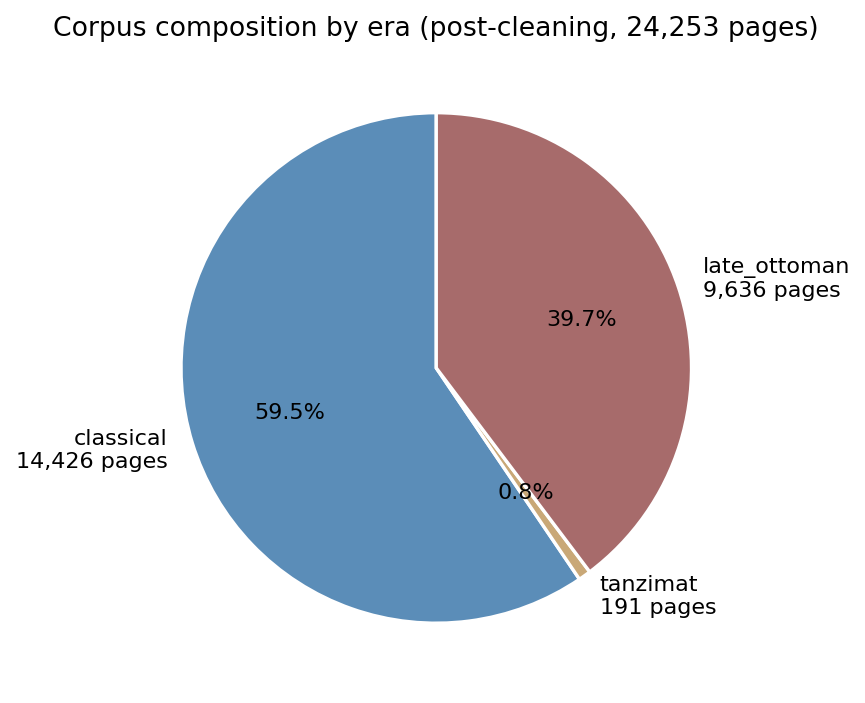

Era is inferred from each document's date label or, when absent, from the publication-year heuristic encoded in the importer (with a hard-coded override for known periodicals whose filenames carry misleading print-run dates). Boundaries follow the spec: classical (≤1838), Tanzimat (1839–1875), late Ottoman (1876+). The actual distribution — 59% classical, 40% late Ottoman, 1% Tanzimat — reflects the source material rather than a deliberate sampling choice; the original sampling-weight target of 20/55/25 from the design spec was recalibrated to 59/40/1 once the real mass was measured.

### 2.2 — Composition by genre

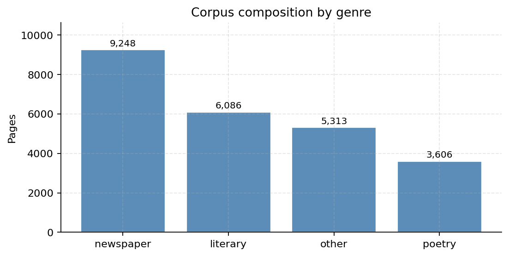

Genre is inferred from document title and group path with a small keyword table. The largest single bucket is *newspaper* — entirely the *Sebilürreşad* / *Sırat-ı Müstakim* periodical run — followed by *literary* (the Evliya travelogue), *other* (works whose titles do not match any keyword and which are mostly historiographical), and *poetry* (the dîvân and mecmua corpus).

### 2.3 — The largest sources

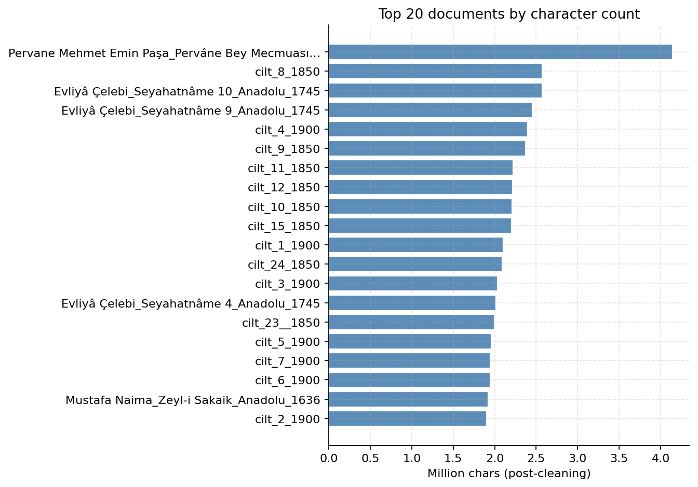

The single largest document is the 1757 *Mecmua* of Pervâne Mehmet Emin Paşa at 4.14 million characters; the 25 volumes of the late-Ottoman periodicals collectively dominate, followed by the seven Evliya volumes at roughly 1.5–2.6 million characters each. Classical works are individually smaller but contribute the bulk of the *classical* era bucket.

### 2.4 — Tokenizer: why train your own

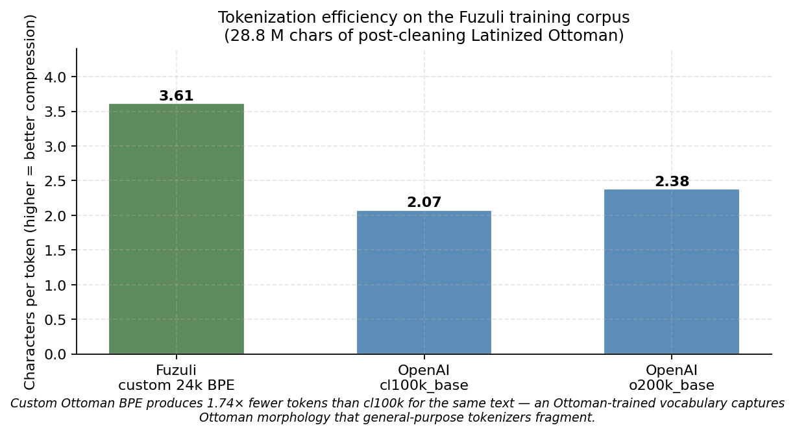

A custom Byte-Pair Encoding (BPE) tokenizer [6] of vocabulary 24,000 was trained on the post-cleaning train split. On the same Ottoman corpus, the custom BPE compresses at **3.61 chars/token**, against **2.07** for OpenAI's `cl100k_base` and **2.38** for the newer `o200k_base` — a **1.74× advantage** over a state-of-the-art general-purpose tokenizer. The reason is straightforward: Ottoman morphology contains long agglutinative chains (`-larımızdaki`, `-mıştır`) and Persian/Arabic loan-stems (`hüsn-ü`, `eser-i`) that general-purpose tokenizers fragment into bytes, while a corpus-trained vocabulary captures them as single subword pieces.

This compression matters for two reasons. **Training efficiency:** every doubling of chars-per-token roughly halves the number of forward passes required for the same amount of text. **Model quality at small scale:** with a fixed parameter budget, a vocabulary that captures meaningful subwords leaves more model capacity for *modeling* the language rather than re-learning that `-mış` is one morphological unit. The 24k vocabulary size is deliberately on the smaller side (LLaMA-2 uses 32k [9], GPT-4 uses 100k+); with only 8M unique training tokens, a 24k vocabulary already places average occurrence per vocab entry at the lower edge of healthy BPE coverage (~330 instances per piece).

## 3 — Architecture

Fuzuli is a standard post-2023 dense decoder transformer. None of its individual components are novel; what is intentional is the *combination* and the discipline of refusing any architectural choice that requires a foreign-weight initializer or a reference-implementation crutch.

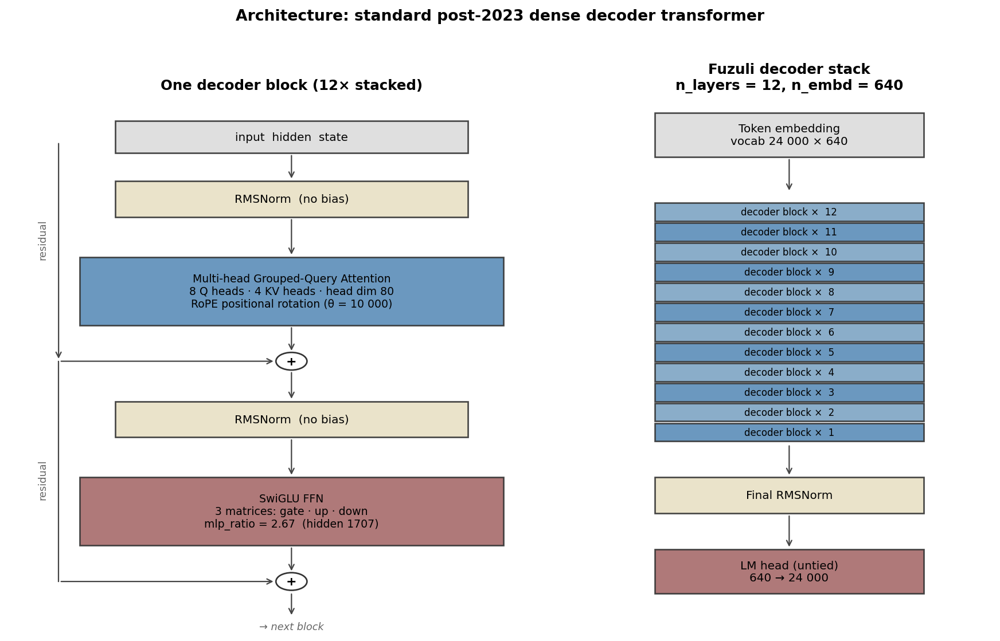

The model dimensions:

| Component | Choice |
|---|---|
| Layers | 12 |
| Hidden dim | 640 |
| Attention heads | 10 (Q) |
| KV heads (GQA) | 4 |
| Head dim | 64 |
| MLP | SwiGLU, mlp_ratio 2.67 (hidden 1707) |
| Positional embedding | RoPE, θ = 10,000 |
| Normalization | RMSNorm, no bias |
| Embedding tying | False (untied LM head) |
| Tokenizer | BPE, vocab 24,000, byte-fallback |
| Total parameters | **≈ 84 M** (15.4 M embedding, 53.1 M body, 15.4 M LM head, 0.6 M misc) |

### 3.1 — Architectural choices in context

Each component reflects current best-practice in dense decoder models post-2023. Walking through them with the relevant references:

- **Decoder-only over encoder-decoder.** Following the GPT family [10] and contemporary open-weight LMs (LLaMA [9], Mistral). Encoder-decoder architectures [8] dominate paired-task settings such as translation and summarization; foundation-style next-token prediction has converged on decoder-only since GPT-3 [10]. For an Ottoman base LM whose primary use case is generation and perplexity scoring, decoder-only is the natural choice.

- **Grouped-Query Attention (GQA).** Introduced by Ainslie et al. 2023 [3], GQA shares K/V projections across multiple query heads, reducing KV-cache memory and inference latency at negligible quality cost. Fuzuli uses 4 KV heads against 10 query heads (a 2.5:1 ratio), aligning with the LLaMA-2 [9] design and with current consensus that GQA is essentially free.

- **Rotary Position Embedding (RoPE).** From Su et al. 2021 [2], RoPE encodes positions as rotation matrices applied to query/key projections. It outperforms sinusoidal absolute positions on long-context extrapolation and underpins essentially every recent open-weight decoder LM. Fuzuli uses θ=10,000 (the original RoPE base; LLaMA-2 also uses 10,000 for sub-2k contexts).

- **SwiGLU MLP.** Shazeer 2020 [4] showed that gated linear units with Swish activation outperform standard GELU feed-forwards at matched parameter counts. The mlp_ratio of 2.67 is the standard SwiGLU ratio that matches the parameter count of a GELU FFN at ratio 4.0 — the choice here is pure parameter-efficiency, not a tuned hyperparameter.

- **RMSNorm.** From Zhang & Sennrich 2019 [5], removes the centering term from LayerNorm — slightly faster, equally stable on the loss surface, fewer learnable parameters. Standard in modern decoder LMs.

- **Untied input/output embeddings.** GPT-2 [10] and many small models tie embedding and unembedding matrices for parameter efficiency. Fuzuli leaves them untied at the cost of an extra 15.4 M parameters; the empirical justification — confirmed by the autoresearch loop, which tried and rejected tied embeddings — is that untied embeddings improve generation-time metrics in low-resource regimes by separating the input-vocabulary and output-vocabulary representational spaces.

- **No bias terms.** Following Touvron et al. 2023 [9] and the wider trend in modern transformer design, Fuzuli omits bias terms in linear projections. Empirically biases contribute little to model quality at this scale and add a small numerical instability.

The training core itself is forked from Karpathy's `nanochat` [11], stripped to single-file form — a deliberate choice that keeps the entire model definition readable in one file, which matters for an autoresearch loop where an LLM-based agent must comprehend and edit the training code.

### 3.2 — Training

| Hyperparameter | Value |
|---|---|
| Total tokens seen | 60,000,000 (≈ 7 epochs over the 8M-token unique corpus) |
| Sequence length | 2,048 |
| Effective batch | 16 × 4 grad-accum = 64 sequences |
| Optimizer | AdamW, β = (0.9, 0.95), wd = 0.1 |
| Learning rate | 6 × 10⁻⁴ peak, cosine schedule, 500 warmup steps |
| Precision | bfloat16 |
| Hardware | Single RTX 4090 |
| Wall clock | ≈ 1 — 2 hours |

This is significantly under Chinchilla-optimal — for an 84M-parameter model the Chinchilla rule [7] recommends ≈1.7 billion tokens, and Fuzuli sees roughly 28× less. Section 7 returns to where this places Fuzuli in the broader scaling landscape.

The compensation is the kind familiar from low-resource modeling: heavy regularization (`weight_decay = 0.2` in the sprint configuration, `0.1` in promotion), early stopping on heldout perplexity, and a deliberately small model size that approaches but does not exceed what the data can support.

## 4 — Autoresearch methodology

The recipe was not hand-tuned. Instead, an LLM-based research agent was given write access to a constrained surface — `train/configs/sprint.yaml`, `train/train.py`, `train/arch.py`, `data/cleaning_rules.yaml` — and instructed to propose one focused change per cycle, run a 5-minute sprint training, observe the results, and iterate. Around this agent sits a **factory**: a deterministic orchestrator that enforces protected-path immutability, scans patches for forbidden architectural patterns, runs the training, evaluates against four metrics, and applies a strict-no-trades accept/reject policy. Accepted experiments are merged into `main`; rejected experiments have their branches deleted but their full record preserved in a SQLite ledger.

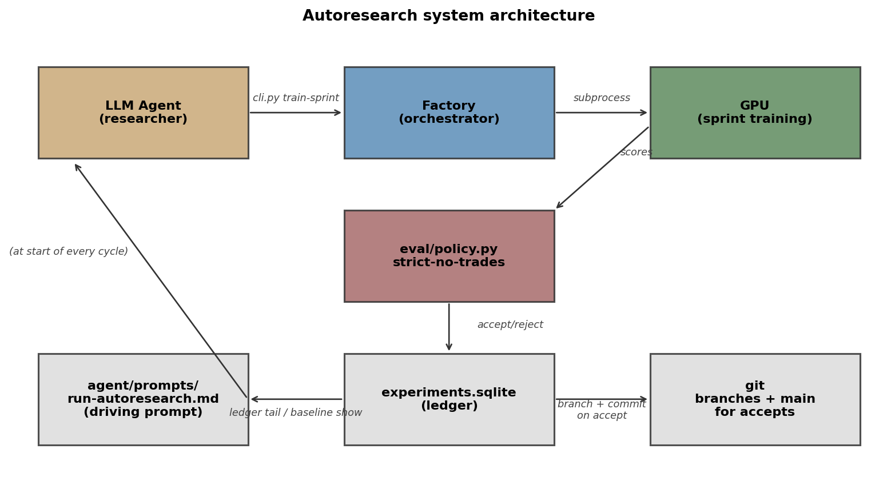

### 4.1 — Design choices in context

Most of Fuzuli's individual components are off-the-shelf. The autoresearch loop itself is part of a growing literature on LLM-driven scientific search: FunSearch [20] demonstrated that an LLM in a closed evaluation loop could discover novel mathematical programs by mutating a designated function while a fixed evaluator gates accept/reject; AlphaEvolve [21] generalized this to algorithmic discovery on a wider problem class; Voyager [22] and Reflexion [23] established LLM-agent patterns for persistent memory and self-correction across episodes. What this project contributes is not the autoresearch primitive itself but a specific combination of design decisions tailored to the sub-Chinchilla single-GPU language-modeling setting:

- **Hard tier-based mutability.** The evaluation harness (`eval/`), the tokenizer artifact, the orchestrator (`factory/`), the CLI, and a handful of policy-defining files are *immutable to the agent*. Any patch that modifies them is rejected at pre-flight by glob-based protected-path checking. The agent has write access only to `train/configs/`, `train/train.py`, `train/arch.py`, and `data/cleaning_rules.yaml`. This guarantees that a recipe accepted by one experiment can be meaningfully compared against another, because the *measurement instrument* never changes.

- **Strict-no-trades policy combiner.** The accept rule is purely Pareto: improve at least one metric beyond an *improvement threshold*, regress no metric beyond a *regression tolerance*. There is no scalar fitness function, no Bayesian-optimization-style negotiated trade-off. This deliberately frustrates clever-but-wrong proposals that would optimize a single metric at the expense of generation quality. It also has the diagnostic property that, when accept rate collapses to zero, the agent has not failed — the data ceiling has been reached.

- **SQLite ledger as agent memory.** The agent's own LLM session is ephemeral (it has a per-turn step budget and may be restarted many times during a long-running campaign), but every experiment ever run — accept, reject_eval, reject_smoke, scores, deltas, reject reasons, branch SHAs, train tokens, train seconds — is preserved in `experiments.sqlite`. A fresh agent session reads `cli.py ledger tail 20` and `cli.py baseline show` at startup, recovering full memory of what has been tried. The ledger is *the* persistent state; the agent is stateless across restarts.

- **Forbidden-pattern scanning before GPU.** The agent cannot import `torch.distributed`, define `MoE`, `Mamba`, `S4`, `Hyena`, or any encoder module. The factory regex-scans every patch before allocating a GPU. This keeps the architecture in a known regime, the experiments comparable, and the wall-clock cost of bad patches bounded to under 30 seconds (the smoke-training pre-flight).

The four metrics:

| Evaluator | What it measures |
|---|---|
| `heldout_ppl` | Bits-per-byte on a frozen heldout split |
| `lexicon_score` | `−log` of the fraction of generated tokens present in an Ottoman lexicon |
| `flatness` | Modern-Turkish loanword rate in generations |
| `smoke` | Fraction of fixed prompts failing deterministic pass/fail rules |

## 5 — Results from the first 24 hours

Over its first 24 hours of operation, the agent ran **356 experiments**: 6 accepts, 343 evaluation rejects, 7 smoke crashes (patches that broke training before the eval phase), and zero infrastructure errors.

### 5.1 — Baseline trajectory across all four metrics

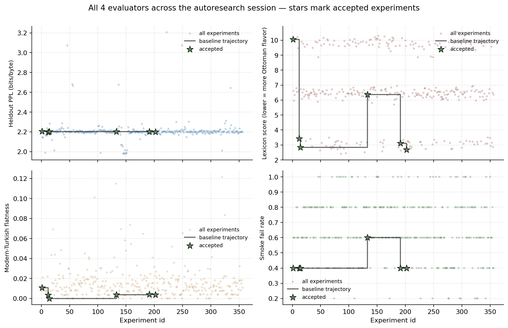

The baseline trajectory (the dark step lines) makes the story visible: the productive period is the first ≈ 14 experiments, during which lexicon score crashes from 10.05 to 2.85 — a 71% reduction driven primarily by a sequence-length change (1024 → 512) and a weight-decay tightening (0.1 → 0.2). Both changes were proposed by the agent without prior bias. Heldout perplexity barely moves throughout, suggesting the model converges to roughly the same data-distribution likelihood under any reasonable recipe; what the recipe actually controls is the *generation-time* behavior captured by the lexicon and flatness metrics.

### 5.2 — Accept rate over time

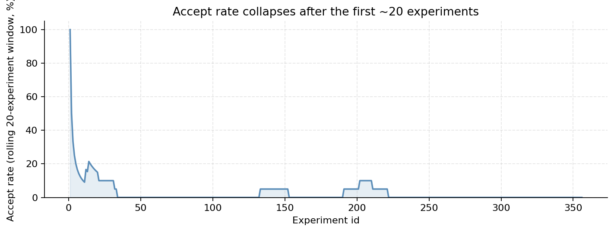

The accept rate peaks above 30% in the early cycles and collapses toward zero by experiment ≈ 50. After experiment ≈ 200 there are no further accepted experiments at all. This is the canonical signature of a recipe-search saturating against its data ceiling — a topic addressed in section 7.

### 5.3 — Why experiments were rejected

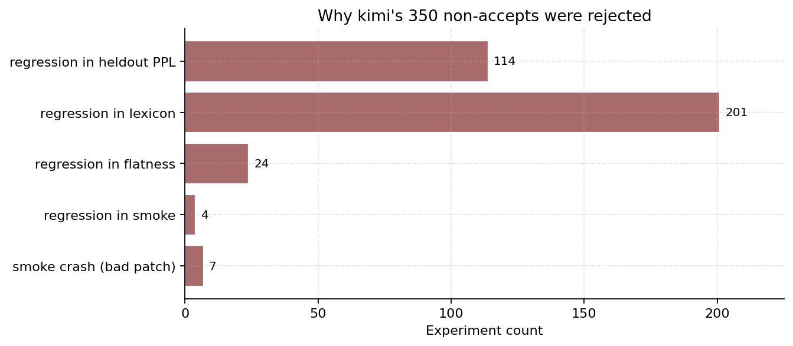

The dominant rejection class is heldout-perplexity regression, followed by lexicon regression. Smoke regressions and flatness regressions are smaller but persistent. Seven smoke crashes — patches whose generated code raised an exception during a 30-second pre-flight training run — were correctly caught before consuming a full sprint's wall clock.

## 6 — What the agent tried

All 356 experiments below were run on the **sprint configuration** — a smaller proxy model (n_layers=6, n_embd=384, n_kv_heads=2, ≈30 M parameters, 25 M training tokens, ≈76 s wall clock) used to discover hyperparameter recipes that are then applied to the larger ≈84 M-parameter promotion model in §3. This separation is by design: sprints are short enough for hundreds of cycles per day; promotions are 1–2 hours each. The autoresearch loop iterates only over sprints. The "baseline" values in the table below therefore reference the sprint config, not the §3 architecture table.

Over the session, the agent traversed essentially the entire standard recipe-search playbook:

| Dimension | Values tried |
|---|---|
| Model width | 384 → 512 (rejected) |
| Number of layers | 6 (baseline), 7, 8 (rejected) |
| KV heads (GQA) | 2 (baseline), 3, 4, 6 (only 3 produced an accept earlier in the run) |
| Peak learning rate | 4e-3, 3.1e-3, 2.8e-3, 2e-3 (all rejected) |
| LR schedule | cosine (baseline), constant (rejected) |
| Warmup steps | 100, 200 (baseline), 300 (only 200 accepted) |
| Weight decay | 0.1, 0.15, 0.2 (baseline), 0.25 (only 0.2 accepted) |
| Init std | 0.015, 0.02 (baseline), 0.03 (rejected) |
| Embedding tying | tied (baseline), untied with init copy (rejected) |
| Dropout | 0.0 (baseline), 0.1 (rejected) |
| Sequence length | 256, 512 (baseline), 1024 (only 512 accepted) |
| Total tokens | 24M, 25M (baseline), 30M (rejected) |
| Era data mix | several variations (all rejected) |
| Random seed | 1, 42 (baseline), 100, 123, 999 |
| Optimizer | AdamW (baseline), Lion [17] (catastrophic; rejected) |

Most of the productive accepts cluster around the early experiments. Once the recipe converged, further changes either failed to improve any metric beyond threshold or improved one while regressing another beyond tolerance.

## 7 — Diagnosis: data ceiling, not recipe ceiling

The most informative single experiment in the entire session is the one the agent ran toward the end, when it began varying only the random seed — every other hyperparameter held constant.

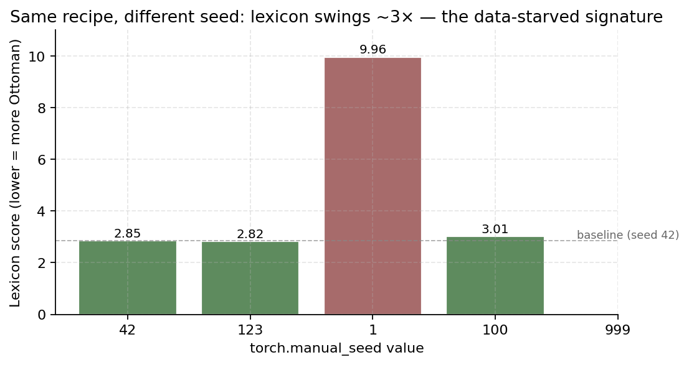

Five seeds, identical configuration. The lexicon score under seed 42 is 2.85; under seed 1 it is 9.96 — a 3.5× swing produced by initialization noise alone. That variance is enormous relative to the 0.05 improvement threshold that the policy requires for acceptance. A run that happens to land in a "good basin" looks dramatically better than a run that lands in a "bad basin," and there is no recipe lever that consistently moves the model into the good basins.

This is the textbook signature of a **data-starved training regime**: when the data signal is weak relative to initialization noise, runs do not converge to the same answer. Heldout perplexity is the more pure data-driven metric — the model has clearly learned the *distribution* of the corpus, since perplexity is rock-stable at ≈ 2.20 across every recipe attempted — but the *generation-time* metrics, which depend on which specific facts and tokens the model has memorized, are dominated by initialization luck.

### 7.1 — Where Fuzuli sits in the scaling landscape

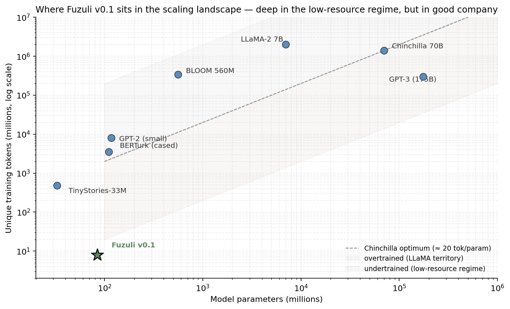

Chinchilla [7] established that for compute-optimal training, the number of *unique* training tokens should scale roughly as 20× the number of parameters. Fuzuli has **8 M unique training tokens for 84 M parameters — a unique-data-to-parameter ratio of 0.095**, against the Chinchilla optimum of 20. That is roughly **200× under** the compute-optimal frontier. (Counting training-token *passes* across the ~7 epochs raises the seen-token ratio to ~0.71, but Chinchilla scaling laws are properly defined on unique data, not on passes; see Muennighoff et al. [24] on data-constrained training, where multiple epochs partly but not fully recover the marginal value of additional unique data.) This places Fuzuli firmly in the *undertrained* / low-resource regime, alongside small from-scratch language-faithful models trained on tightly curated corpora [13]. When the corpus is the binding constraint, the choice is between a smaller model that fits the data (Fuzuli's path) or a larger model that overfits hard (the path rejected by the spec amendments during planning).

The opposite end of the landscape is illustrative. LLaMA-2-7B was trained on 2 trillion tokens for 7 billion parameters [9] — a ratio of ~286 tok/param, fully 14× *over* the Chinchilla optimum. The modern best practice for production LMs is *intentional overtraining*, because inference-time cost dominates training-time cost at deployment scale. Fuzuli takes the opposite trade because there is no deployment-scale inference and there is no 2T-token Ottoman corpus.

The corollary is that further sprint iteration on the current corpus will not produce meaningful gains. The recipe space is saturated; the data is the binding constraint. This is not a failure mode of the autoresearch system — it is the autoresearch system honestly diagnosing the state of the world.

## 8 — Honest limitations of v0.1

The model **will**:

- generate plausible Ottoman-Turkish continuations for short prompts;
- score perplexity on novel Ottoman text reliably enough for OCR-confidence and era-proximity scoring;
- provide useful Ottoman embeddings if a mean-pooling head is attached;
- demonstrate that a from-scratch Latinized Ottoman LM at this size is feasible.

The model **will not**:

- produce coherent long-form generation; expect memorized 3–5-token windows from the training corpus;
- handle out-of-distribution text well — Arabic-script Ottoman, modern Turkish, conversational registers all degrade sharply;
- exhibit world knowledge of any kind beyond what is implicit in the corpus;
- replace human judgment on any historical-translation or paleographic task.

This is a research artifact. Treat it as one.

## 9 — Roadmap

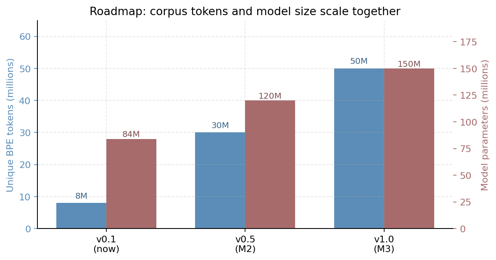

Future versions of Fuzuli scale together with the corpus. Approximate targets:

| Version | Unique BPE tokens | Parameters | Notes |
|---|---|---|---|
| **v0.1** (this release) | 8 M | 84 M | Proof of concept; over-fits stylistically |
| **v0.5** | 30 M | 120 M | Meaningful long-form generation; multiple registers distinguishable |
| **v1.0** | 50 M | 150 M | Genuinely competitive low-resource Ottoman LM |

Corpus growth is the main bottleneck. Sources under consideration include the remaining un-OCR'd late-Ottoman periodicals (*İkdam*, *Tasvir-i Efkâr*, *Mizan*, *Tercümân-ı Ahvâl*), Latinized Ottoman primary-source passages embedded in Turkish-studies dissertations available through the YÖK Tez archive, and academic encyclopedia entries from TDV İslâm Ansiklopedisi.

A parallel encoder track (BERT-style [15] masked-language-model pretraining on the same corpus) is also planned. Encoder objectives are substantially more sample-efficient than decoder objectives; the existing 8M tokens are comfortable for a 50–80M-parameter encoder, and a useful Ottoman-text-classification / search artifact can be released without waiting for corpus growth.

## 10 — License & contact

- **Code**: Apache-2.0
- **Model weights**: Apache-2.0
- **Dataset**: CC-BY-4.0
- **This article and its diagrams**: CC-BY-4.0

This work is released under my own name without external attribution claims. Comments, corrections, and proposed corpus contributions are welcome via the GitHub repository at `github.com/fbkaragoz/asena-project`.

---

## References

[1] Vaswani, A. *et al.* (2017). **Attention Is All You Need.** *NeurIPS 2017.*

[2] Su, J., Lu, Y., Pan, S., Murtadha, A., Wen, B., Liu, Y. (2021). **RoFormer: Enhanced Transformer with Rotary Position Embedding.** *arXiv:2104.09864.*

[3] Ainslie, J., Lee-Thorp, J., de Jong, M., Zemlyanskiy, Y., Lebrón, F., Sanghai, S. (2023). **GQA: Training Generalized Multi-Query Transformer Models from Multi-Head Checkpoints.** *EMNLP 2023.*

[4] Shazeer, N. (2020). **GLU Variants Improve Transformer.** *arXiv:2002.05202.*

[5] Zhang, B., Sennrich, R. (2019). **Root Mean Square Layer Normalization.** *NeurIPS 2019.*

[6] Sennrich, R., Haddow, B., Birch, A. (2016). **Neural Machine Translation of Rare Words with Subword Units.** *ACL 2016.*

[7] Hoffmann, J. *et al.* (2022). **Training Compute-Optimal Large Language Models** (the *Chinchilla* paper). *arXiv:2203.15556.*

[8] Raffel, C. *et al.* (2020). **Exploring the Limits of Transfer Learning with a Unified Text-to-Text Transformer** (T5). *JMLR 21(140).*

[9] Touvron, H. *et al.* (2023). **LLaMA 2: Open Foundation and Fine-Tuned Chat Models.** *arXiv:2307.09288.*

[10] Brown, T. B. *et al.* (2020). **Language Models are Few-Shot Learners** (GPT-3). *NeurIPS 2020.*

[11] Karpathy, A. (2024-). **nanoGPT / nanochat** training core. *github.com/karpathy/nanoGPT.*

[12] Schweter, S. (2020). **BERTurk — BERT Models for Turkish.** *Zenodo. doi:10.5281/zenodo.3770924.*

[13] Eldan, R., Li, Y. (2023). **TinyStories: How Small Can Language Models Be and Still Speak Coherent English?** *arXiv:2305.07759.*

[14] Conneau, A. *et al.* (2020). **Unsupervised Cross-lingual Representation Learning at Scale** (XLM-R). *ACL 2020.*

[15] Devlin, J., Chang, M.-W., Lee, K., Toutanova, K. (2019). **BERT: Pre-training of Deep Bidirectional Transformers for Language Understanding.** *NAACL 2019.*

[16] Suárez, P. J. O., Romary, L., Sagot, B. (2019). **Asynchronous Pipeline for Processing Huge Corpora on Medium to Low Resource Infrastructures** (the OSCAR corpus, basis for many low-resource national LMs). *Workshop on Challenges in the Management of Large Corpora.*

[17] Chen, X. *et al.* (2023). **Symbolic Discovery of Optimization Algorithms** (the *Lion* optimizer). *arXiv:2302.06675.*

[18] Karagöz, F., Doğan, B., Özateş, Ş. B. (2024). **Towards a Clean Text Corpus for Ottoman Turkish.** *Proceedings of the First Workshop on Natural Language Processing for Turkic Languages (SIGTURK 2024), pp. 62–70, Association for Computational Linguistics.*

[19] Özateş, Ş. B., Tıraş, T. E., Adak, E. E., Doğan, B., Karagöz, F. B., Genç, E. E., Taşdemir, E. F. B. (2025). **Building Foundations for Natural Language Processing of Historical Turkish: Resources and Models.** *arXiv:2501.04828.*

[20] Romera-Paredes, B. *et al.* (2024). **Mathematical discoveries from program search with large language models** (FunSearch). *Nature 625, 468–475.*

[21] Novikov, A. *et al.* (2025). **AlphaEvolve: A coding agent for scientific and algorithmic discovery.** *DeepMind / arXiv.*

[22] Wang, G. *et al.* (2023). **Voyager: An Open-Ended Embodied Agent with Large Language Models.** *arXiv:2305.16291.*

[23] Shinn, N., Cassano, F., Berman, E., Gopinath, A., Narasimhan, K., Yao, S. (2023). **Reflexion: Language Agents with Verbal Reinforcement Learning.** *NeurIPS 2023.*

[24] Muennighoff, N. *et al.* (2023). **Scaling Data-Constrained Language Models.** *NeurIPS 2023.*

---

*Fatih Burak Karagöz, May 2026.*
